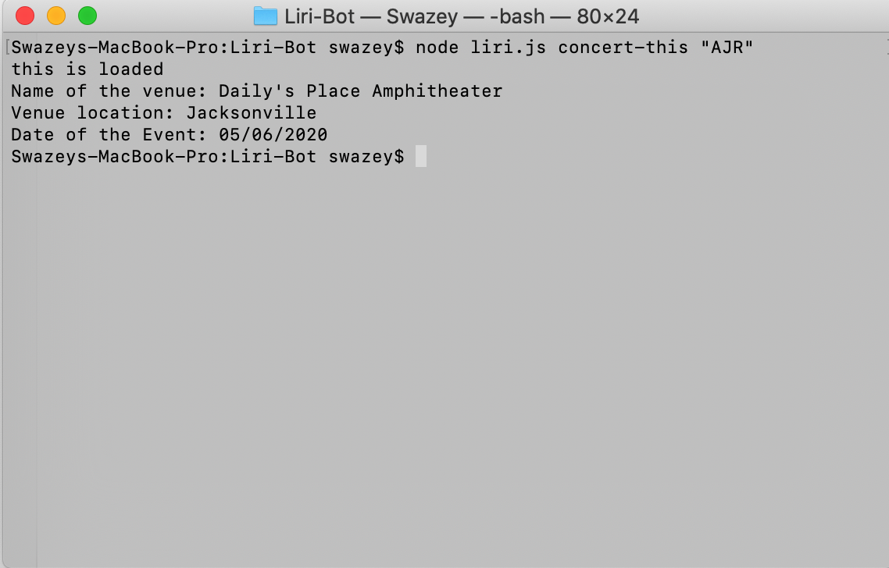
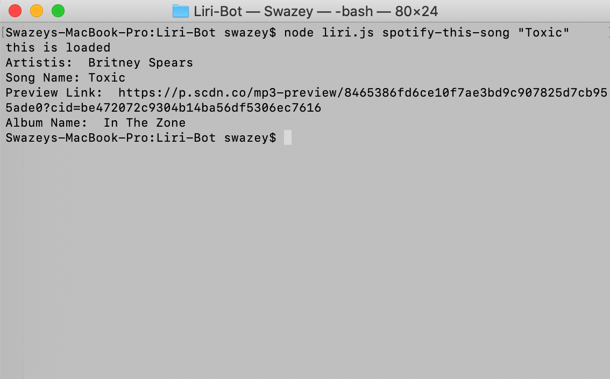
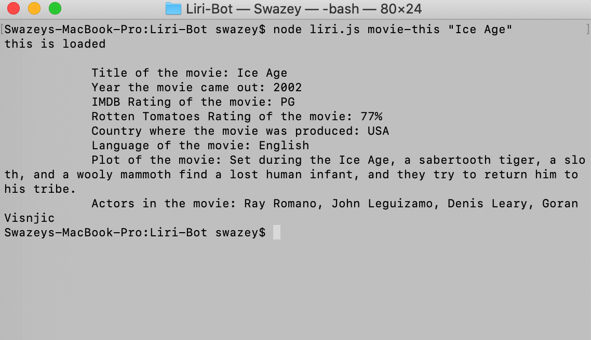
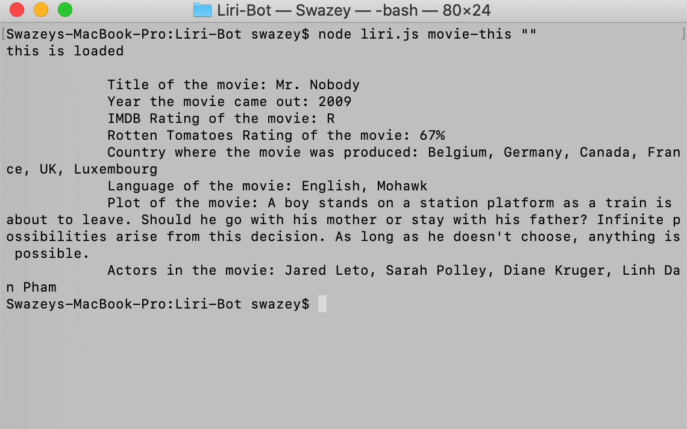
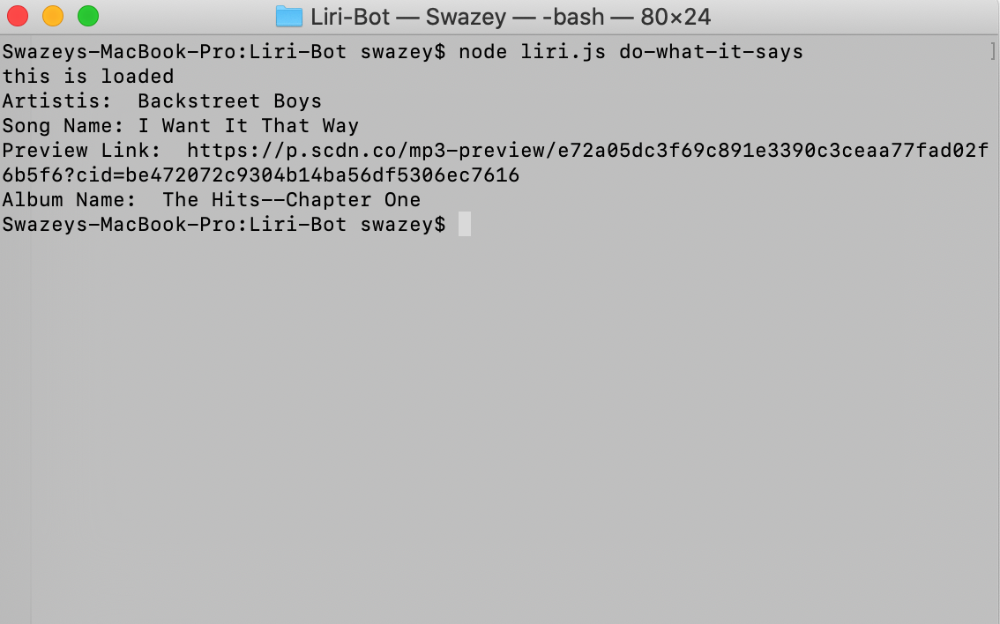

# Project: LIRI Bot

**LIRI** is a Language Interpretation and Recognition Interface. 

## Overview

LIRI is like iPhone's SIRI. However, while SIRI is a Speech Interpretation and Recognition Interface, LIRI is a _Language_ Interpretation and Recognition Interface. LIRI is a command line node app that takes in parameters and gives data in return.

## Challenge

Use Node JS to create a LIRI bot, like iPhone's SIRI, but takes in commands through Language vs Speech using the following commands:

## concert-this

## spotify-this-song

## movie-this

## do-what-it-says

